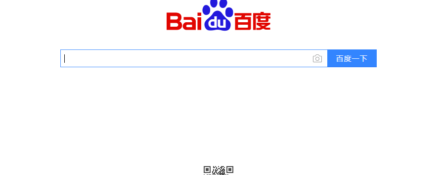

## atom 配置

windows下使用快捷键 ctrl + shift + p，打开命令输入框；

3、输入 markdown preview toggle(可以偷懒只输入mdpt，支持模糊匹配)

也可以通过菜单栏Packages->Markdown Preview->Toggle Treview;

按enter键即可看到预览，左边编辑，右边实时预览:

也可以直接使用快捷键不过由于快捷键冲突问题可能没效果，当你熟悉Atom之后你也可以定制属于直接的一套快捷键；

my git ID

 67dd3c0e198e5ceab60e6c1cd195742061692fe0

github gist创新，微码分享
https://blog.csdn.net/fishmai/article/details/52398490
同步atom设置
https://www.cnblogs.com/hooray/p/5885211.html

Gist 服务
https://blog.csdn.net/B9Q8e64lO6mm/article/details/78986359

代码片段收藏软
Gist 服务

gist.github.com 被墙无法访问解决办法

windows下 打开C:\Windows\System32\drivers\etc\hosts文件

编辑器打开，在最后行添加192.30.253.118 gist.github.com

保存。

使用Atom打造无懈可击的Markdown编辑器
https://www.cnblogs.com/libin-1/p/6638165.html

