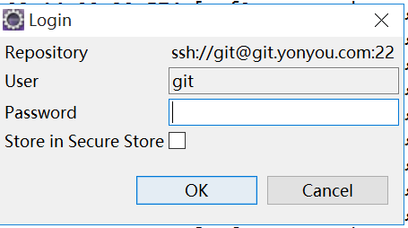

1、初始化仓库 教程

## [Git-查看远程分支、本地分支、创建分支]

###### 1.查看本地分支

```
$ git branch
```

###### 2.查看远程分支

```
$ git branch -r
  origin/HEAD -> origin/master
  origin/feature/IOS_visualtrack
  origin/feature/android_visualtrack
  origin/maste
```

###### 3.查看所有分支

```
git branch -a
* br-2.1.2.2
  master
  remotes/origin/HEAD -> origin/master
  remotes/origin/br-2.1.2.1
  remotes/origin/br-2.1.2.2
  remotes/origin/br-2.1.3
  remotes/origin/master
```

###### 切换远程分支

$ git branch -a
* master
  remotes/origin/HEAD -> origin/master
  remotes/origin/Release
  remotes/origin/master

$ git checkout -b myRelease origin/Release
Branch myRelease set up to track remote branch Release from origin.
Switched to a new branch 'myRelease'

PS:作用是checkout远程的Release分支，在本地起名为myRelease分支，并切换到本地的myRelase分支  

### 5.合并分支

合并前要先切回**要并入**的分支

以下表示要把issue1234分支合并入master分支

```
$: git checkout master
$: git merge issue1234
Merge made by recursive.
 README |    1 +
 1 files changed, 1 insertions(+), 0 deletions(-)
```

6.撤消上一次commit的内容(该操作会彻底回退到某个版本，本地的源码也会变为上一个版本的内容)

git reset --hard <commit-id>

以下表示要撤消“update build gradle configuration file”这一次的commit id,返回到"add battery settings ui"这一次的commit id,

xp.chen@YC-JG-YXKF-PC27 MINGW64 /f/ob ((c8303a9...))
$ git log
commit c8303a9e8db2bcf4edb7488e722a380f4e8858ec (HEAD)
Author: xp.chen <xp.chen@yuneec.com>
Date:   Sat Oct 28 09:28:51 2017 +0800

    update build gradle configuration file
    
    Change-Id: I9ee532fd0d4698613698a64eb754fb98a8559e32

commit 8d8e5ccf24cf6836ab780aa3860270c3876e825a
Author: xp.chen <xp.chen@yuneec.com>
Date:   Sat Oct 28 09:02:01 2017 +0800

    add battery settigns ui
    
    Change-Id: Ia907ee4e84f54c00a186d31378a7925a6adaba0e

xp.chen@YC-JG-YXKF-PC27 MINGW64 /f/ob ((c8303a9...))
$ git reset --hard 8d8e5ccf24cf6836ab780aa3860270c3876e825a
HEAD is now at 8d8e5cc add battery settigns ui

xp.chen@YC-JG-YXKF-PC27 MINGW64 /f/ob ((8d8e5cc...))
$ git log
commit 8d8e5ccf24cf6836ab780aa3860270c3876e825a (HEAD)
Author: xp.chen <xp.chen@yuneec.com>
Date:   Sat Oct 28 09:02:01 2017 +0800

    add battery settigns ui
    
    Change-Id: Ia907ee4e84f54c00a186d31378a7925a6adaba0e


##### git add -A 和 git add . 的区别

git add -A和 git add .   git add -u在功能上看似很相近，但还是存在一点差别

**git add** . ：他会监控工作区的状态树，使用它会把工作时的所有变化提交到暂存区，包括文件内容修改(modified)以及新文件(new)，但不包括被删除的文件。

**git add -u** ：他仅监控已经被add的文件（即tracked file），他会将被修改的文件提交到暂存区。add -u 不会提交新文件（untracked file）。（git add --update的缩写）

**git add -A** ：是上面两个功能的合集（git add --all的缩写）

- 总结

·  git add -A  **提交所有变化**

·  git add -u  **提交被修改(modified)和被删除(deleted)文件，不包括新文件(new)**

·  git add .  **提交新文件(new)和被修改(modified)文件，不包括被删除(deleted)文件**


##### Git命令行添加整个文件夹及目录

git add 文件夹/            添加整个文件夹及内容

git add *.文件类型       添加目录中所有此文件类型的文件

********

###  撤销操作


- git status 先看一下add 中的文件
在**我未提交之前**，我发现添加文件5555555555555内容有误，所以我得马上恢复以前的版本，现在我可以有如下几种方法可以做修改：

第一：如果我知道要删掉那些内容的话，直接手动更改去掉那些需要的文件，然后add添加到暂存区，最后commit掉。

第二：我可以按以前的方法直接**恢复到上一个版本**。使用 git reset –hard head^ （这意味着必本地的代码回退到上个版本后，需要在重新 pull 一次，才能保证本地库的代码和远程分支的代码版本相同，否则本地的代码版本比远程分支低，容易覆盖远程的代码）

**用命令丢弃本地文件的代码修改**

*  git checkout -- 文件名

eg：$ git checkout -- git操作.md

命令 $ git checkout -- git操作.md 意思就是，把readme.txt文件在工作区做的修改全部撤销，这里有2种情况，如下：

* 1.git操作.mdt自动修改后，还没有放到暂存区，使用 撤销修改就回到和版本库一模一样的状态。

* 2.**另外一种是readme.txt已经放入暂存区了，接着又作了修改，撤销修改就回到添加暂存区后的状态.**
 **其实也就是撤销到最后一次没有放入暂存区的状态**

[效果](https://blog.csdn.net/zch501157081/article/details/51939854)


###### Git中git commit -m 与git commit -a -m  的区别

一般仓库中的文件可能存在于这三种状态：

1）**Untracked files** → 文件未被跟踪；

2）**Changes to be committed** → 文件已缓存，这是下次提交的内容；

3）**Changes bu not updated** → 文件被修改，但并没有添加到缓存区。

**git commit -m **  只会提交添加到缓存区的文件**（**只提交添加的**）

**git commit -a -m ** 能提交修改过，但是没有添加到缓存区的文件（**修改过的就能提交**）

**git commit -a**   就是自动去把之前标记过的文件再标记上，包括删除的文件，但是不包括新增的文件。

使用命令：git log  能查看提交历史，后面加上  --pretty=oneline  能使内容单行显示

使用命令：git status  能让我们时刻掌握仓库当前的状态


7. git commit -m 注释换行

8. $ git commit -m '
   > 1.aaaaa
   > 2.bbbb
   > '
   > [master b25154b] 1.aaaaa 2.bbbb
   > file changed, 0 insertions(+), 0 deletions(-)
   >  create mode 100644 ss.txt
   >
   > 通过git commit --amend 命令可以查看到刚刚的log信息为
   >
   > ```
   > 1.aaaaa
   > 2.bbbb
   > ```


###### git 中怎样查看未传送(git push)到远程代码库的(git commit)提交?

可以查看已经commit 但是还没有push 的代码

git log master ^origin/master


**2,查看到未传送到远程代码库的****提交描述/说明**

` git cherry -v                                                                                                                                                             `


3. 查看本地代码的提交和未提交的文件

1. git status


###### git本地检出一个新的分支并推送到远程仓库

git checkout -b 新分支名

+ 推送本地分支到远程仓库

**git push --set-upstream origin**

eg:
git push --set-upstream origin  release

这个只是切换分支如果需要将内容推送上去，还需要执行

+ git add -u 添加修改过的文件
+ git commit -m 'XXX' 提交修改过的文件
+ git push origin release  将修改过的文件推送到远程分支

将远程git仓库里的指定分支拉取到本地（本地不存在的分支）

**git checkout -b 本地分支名 origin/远程分支名**
这个将会自动创建一个新的本地分支，并与指定的远程分支关联起来。
例如远程仓库里有个分支develop,我本地没有该分支，我要把develop拉到我本地：

有时候会报错
fatal: Cannot update paths and switch to branch 'dev2' at the same time.
这个时候需要执行

**git fetch**

然后再执行
**git checkout -b 本地分支名 origin/远程分支名**

###### git关联本地仓库和远程仓库

我们在本地新建一个叫devtest的分支的时候，我们希望他与git远程上的某个分支进行关联。

假设远程上的那个分支也叫devtest，如果我们直接去pull代码，会报下面的错
提示我们需要用 –set-upstream 去关联这两个分支，命令是

git branch --set-upstream devtest origin/devtest
你执行这句命令之后，他又会提示你–set-upstream要换成–set-upstream-to命令

–set-upstream-to 在新版本git中已经替代了 –set-upstream， 并且后面跟随的两个参数要对调一下，如下面命令

**git branch --set-upstream-to origin/develop develop**

分支合并

git的分支合并一般都在本地进行，在分支合并的时候创建一个新的文件夹，然后重新down一份新的代码到这个文件夹中（避免idea等工具生成的文件的影响），然后在这个新的文件夹中进行文件的合并

### 合并分支

###### release分支合并
* 为release新建工作空间，并clone相应的代码到工作空间
* 切换分支到develop_merge
* 执行git pull origin develop_merge
* 切换分支到release
* 执行git merge develop_merge
* 执行git status，查看当前代码状态
* 执行git pull origin release
* 执行git push origin release

###### master分支合并
* 为master新建工作空间，并clone相应的代码到工作空间
* 切换分支到release
* 执行git pull origin release
* 切换分支到master
* 执行git merge release
* 执行git status，查看当前代码状态
* 执行git pull origin master
* 执行git push origin master


 git status -uno 查看冲突文件
  git add  提交文件

  git commit  -m'all'   提交加入satge的文件


###### Git合并某个分支的一个commit到另一个分支


例如要将A分支的一个commit合并到B分支：

首先切换到A分支

git checkout A

git log

找出要合并的commit ID :

例如

0128660c08e325d410cb845616af355c0c19c6fe

然后切换到B分支上

git checkout B

git cherry-pick  0128660c08e325d410cb845616af355c0c19c6fe

然后就将A分支的某个commit合并到了B分支了


# 解决冲突
[廖雪峰git官网](https://www.liaoxuefeng.com/wiki/0013739516305929606dd18361248578c67b8067c8c017b000/001375840202368c74be33fbd884e71b570f2cc3c0d1dcf000)

在本地合并产冲突的原因 分支1 修改问文件commit后未远程push到远程，然后切换分支到分分之二，再次commit到分支2 ，然后在merge分支1和分支2产生冲突；git merge feature1

打开冲突文件把冲突文件把冲突结局然后在git add -u ;git  commit -m '结局冲突' git push orgin 分支2

Git用<<<<<<<，=======，>>>>>>>标记出不同分支的内容，我们修改如下后保存：

######  git查看某个文件的修改历史
首先切换到要查看的文件所在的目录：

cd packages/apps/Mms/src/com/android/mms/ui/

二、git log --pretty
然后使用下面的命令可列出文件的所有改动历史，注意，这里着眼于具体的一个文件，而不是git库，如果是库，那改动可多了去了～

git log --pretty=oneline 文件名

## 

# rebase 用法小结


rebase在git中是一个非常有魅力的命令，使用得当会极大提高自己的工作效率；相反，如果乱用，会给团队中其他人带来麻烦。它的作用简要概括为：可以对某一段线性提交历史进行编辑、删除、复制、粘贴；因此，合理使用rebase命令可以使我们的提交历史干净、简洁！

前提：不要通过rebase对任何已经提交到公共仓库中的commit进行修改（你自己一个人玩的分支除外）

###### 1.合并多个commit为一个完整commit


现在我们在测试分支上添加了四次提交，我们的目标是把最后三个提交合并为一个提交：

 


这里我们使用命令:

```
  git rebase -i  [startpoint]  [endpoint]
```

其中`-i`的意思是`--interactive`，即弹出交互式的界面让用户编辑完成合并操作，`[startpoint]`  `[endpoint]`则指定了一个编辑区间，如果不指定`[endpoint]`，则该区间的终点默认是当前分支`HEAD`所指向的`commit`(注：该区间指定的是一个前开后闭的区间)。
 在查看到了log日志后，我们运行以下命令：

```
git rebase -i 36224db
```

或:

```
git rebase -i HEAD~3 
```

然后我们会看到如下界面:


 

```
pick
```

> - pick：保留该commit（缩写:p）
> - reword：保留该commit，但我需要修改该commit的注释（缩写:r）
> - edit：保留该commit, 但我要停下来修改该提交(不仅仅修改注释)（缩写:e）
> - squash：将该commit和前一个commit合并（缩写:s）
> - fixup：将该commit和前一个commit合并，但我不要保留该提交的注释信息（缩写:f）
> - exec：执行shell命令（缩写:x）
> - drop：我要丢弃该commit（缩写:d）

根据我们的需求，我们将commit内容编辑如下: 


然后是注释修改界面:


 

编辑完保存即可完成commit的合并了： 


###### 2.将某一段commit粘贴到另一个分支上

当我们项目中存在多个分支，有时候我们需要将某一个分支中的一段提交同时应用到其他分支中，就像下图：


 

```
git cherry-pick
```

 

 

master分支:


develop分支:

 


```
我们使用命令的形式为
git rebase   [startpoint]   [endpoint]  --onto  [branchName]
```

其中，`[startpoint]`  `[endpoint]`仍然和上一个命令一样指定了一个编辑区间(前开后闭)，`--onto`的意思是要将该指定的提交复制到哪个分支上。
 所以，在找到C(90bc0045b)和E(5de0da9f2)的提交id后，我们运行以下命令：

```
    git  rebase   90bc0045b^   5de0da9f2   --onto master
```

注:因为`[startpoint]`  `[endpoint]`指定的是一个前开后闭的区间，为了让这个区间包含C提交，我们将区间起始点向后退了一步。
 运行完成后查看当前分支的日志:


可以看到，C~E部分的提交内容已经复制到了G的后面了，大功告成？NO！我们看一下当前分支的状态: 


 

当前HEAD处于游离状态，实际上，此时所有分支的状态应该是这样: 


 

所以，虽然此时HEAD所指向的内容正是我们所需要的，但是master分支是没有任何变化的，`git`只是将C~E部分的提交内容复制一份粘贴到了master所指向的提交后面，我们需要做的就是将master所指向的提交id设置为当前HEAD所指向的提交id就可以了，即: 

```
git checkout master
      git reset --hard  0c72e64
```


 

 此时我们才大功告成！

注：文中如有任何错误，请各位批评指正！

 

##  **Git 常用命令速查手册**

 

###### 1、初始化仓库

```
git init
```

######  2、将文件添加到仓库 

```
git add 文件名 # 将工作区的某个文件添加到暂存区   
git add -u # 添加所有被tracked文件中被修改或删除的文件信息到暂存区，不处理untracked的文件
git add -A # 添加所有被tracked文件中被修改或删除的文件信息到暂存区，包括untracked的文件
git add . # 将当前工作区的所有文件都加入暂存区
git add -i # 进入交互界面模式，按需添加文件到缓存区
```

###### 3、将暂存区文件提交到本地仓库 

```
git commit -m "提交说明" # 将暂存区内容提交到本地仓库
git commit -a -m "提交说明" # 跳过缓存区操作，直接把工作区内容提交到本地仓库
```

###### 4、查看仓库当前状态 

```
git status
```

###### 5、比较文件异同 

```
git diff # 工作区与暂存区的差异
git diff 分支名 #工作区与某分支的差异，远程分支这样写：remotes/origin/分支名
git diff HEAD  # 工作区与HEAD指针指向的内容差异
git diff 提交id 文件路径 # 工作区某文件当前版本与历史版本的差异
git diff --stage # 工作区文件与上次提交的差异(1.6 版本前用 --cached)
git diff 版本TAG # 查看从某个版本后都改动内容
git diff 分支A 分支B # 比较从分支A和分支B的差异(也支持比较两个TAG)
git diff 分支A...分支B # 比较两分支在分开后各自的改动

# 另外：如果只想统计哪些文件被改动，多少行被改动，可以添加 --stat 参数
```

###### 6、查看历史记录 

```
git log # 查看所有commit记录(SHA-A校验和，作者名称，邮箱，提交时间，提交说明)
git log -p -次数 # 查看最近多少次的提交记录
git log --stat # 简略显示每次提交的内容更改
git log --name-only # 仅显示已修改的文件清单
git log --name-status # 显示新增，修改，删除的文件清单
git log --oneline # 让提交记录以精简的一行输出
git log –graph –all --online # 图形展示分支的合并历史
git log --author=作者  # 查询作者的提交记录(和grep同时使用要加一个--all--match参数)
git log --grep=过滤信息 # 列出提交信息中包含过滤信息的提交记录
git log -S查询内容 # 和--grep类似，S和查询内容间没有空格
git log fileName # 查看某文件的修改记录，找背锅专用
```

###### 7、代码回滚 

```
git reset HEAD^ # 恢复成上次提交的版本
git reset HEAD^^ # 恢复成上上次提交的版本，就是多个^，以此类推或用~次数

git reflog

git reset --hard 版本号

--soft：只是改变HEAD指针指向，缓存区和工作区不变；
--mixed：修改HEAD指针指向，暂存区内容丢失，工作区不变；
--hard：修改HEAD指针指向，暂存区内容丢失，工作区恢复以前状态；
```

###### 8、同步远程仓库 

```
git push -u origin master
```

###### 9、删除版本库文件 

```
git rm 文件名
```

###### 10、版本库里的版本替换工作区的版本 

```
git checkout -- test.txt
```

###### 11、本地仓库内容推送到远程仓库 

```
git remote add origin git@github.com:帐号名/仓库名.git
```

###### 12、从远程仓库克隆项目到本地 

```
git clone git@github.com:git帐号名/仓库名.git
```

###### 13、创建分支 

```
git checkout -b dev
-b表示创建并切换分支
上面一条命令相当于一面的二条：
git branch dev //创建分支
git checkout dev //切换分支
```

###### 14、查看分支

```
git branch
```

######  15、合并分支

```
git merge dev
//用于合并指定分支到当前分支

git merge --no-ff -m "merge with no-ff" dev
//加上--no-ff参数就可以用普通模式合并，合并后的历史有分支，能看出来曾经做过合并
```

###### 16、删除分支 

```
git branch -d dev
```

###### 17、查看分支合并图 

```
git log --graph --pretty=oneline --abbrev-commit
```

###### 18、查看远程库信息 

```
git remote
// -v 显示更详细的信息
```

###### 19、git相关配置 

```
# 安装完Git后第一件要做的事，设置用户信息(global可换成local在单独项目生效)：
git config --global user.name "用户名" # 设置用户名
git config --global user.email "用户邮箱"   #设置邮箱
git config --global user.name   # 查看用户名是否配置成功
git config --global user.email   # 查看邮箱是否配置

# 其他查看配置相关
git config --global --list  # 查看全局设置相关参数列表
git config --local --list # 查看本地设置相关参数列表
git config --system --list # 查看系统配置参数列表
git config --list  # 查看所有Git的配置(全局+本地+系统)
git config --global color.ui true //显示git相关颜色
```

###### 20、撤消某次提交 

```
git revert HEAD # 撤销最近的一个提交
git revert 版本号 # 撤销某次commit
```

###### 21、拉取远程分支到本地仓库 

```
git checkout -b 本地分支 远程分支 # 会在本地新建分支，并自动切换到该分支
git fetch origin 远程分支:本地分支 # 会在本地新建分支，但不会自动切换，还需checkout
git branch --set-upstream 本地分支 远程分支 # 建立本地分支与远程分支的链接
```

###### 22、标签命令 	

```
git tag 标签 //打标签命令，默认为HEAD
git tag //显示所有标签
git tag 标签 �版本号 //给某个commit版本添加标签
git show 标签 //显示某个标签的详细信息
```

###### 23、同步远程仓库更新 

```
git fetch  origin master
 //从远程获取最新的到本地，首先从远程的origin的master主分支下载最新的版本到origin/master分支上，然后比较本地的master分支和origin/master分支的差别，最后进行合并。

git fetch比git pull更加安全
```


### **1、git基本命令**

1）git add 将想要快照的内容写入缓存区
2）git status -s "AM" 状态的意思是，这个文件在我们将它添加到缓存之后又有改动
3）git commit -m '第一次版本提交' -m选项添加备注信息
4）git clone url 使用 git clone 拷贝一个 Git 仓库到本地
5）git diff 查看执行 git status 的结果的详细信息
　　尚未缓存的改动：git diff
　　查看已缓存的改动： git diff --cached
　　查看已缓存的与未缓存的所有改动：git diff HEAD
　　显示摘要而非整个 diff：git diff --stat
6）git commit -a 跳过git add 提交缓存的流程 
7）git reset HEAD 用于取消已缓存的内容
8）git rm file 
　　git rm 会将条目从缓存区中移除。这与 git reset HEAD 将条目取消缓存是有区别的。
　　"取消缓存"的意思就是将缓存区恢复为我们做出修改之前的样子。
　　默认情况下，git rm file 会将文件从缓存区和你的硬盘中（工作目录）删除。
9）git mv 重命名磁盘上的文件 如 git mv README README.md

10）git push -u origin master 提交代码

### **2、git 分支管理**

1）创建分支命令 git branch (branchname) 列出分支 git branch
2）切换分支命令 git checkout (branchname)
3）合并分支 git merge (branchname)
4）创建新分支并立即切换到该分支下 git checkout -b (branchname)
5）删除分支命令 git branch -d (branchname)
ps:状态 uu 表示冲突未解决 可以用 git add 要告诉 Git 文件冲突已经解决

### 3、查看日志版本

git log 命令列出历史提交记录
git log --oneline 查看历史记录的简洁的版本
git log --oneline --graph 查看历史中什么时候出现了分支、合并

### **4、标签**

为软件发布创建标签是推荐的。这个概念早已存在，在 SVN 中也有。你可以执行如下命令创建一个叫做 1.0.0 的标签：
git tag 1.0.0 1b2e1d63ff
1b2e1d63ff 是你想要标记的提交 ID 的前 10 位字符。可以使用下列命令获取提交 ID：
git log
你也可以使用少一点的提交 ID 前几位，只要它的指向具有唯一性

### **5、提取远程仓库代码**

1）git fetch　　从远程仓库下载新分支与数据

2)）git pull　　从远端仓库提取数据并尝试合并到当前分支

**6、git分支**

git-flow主要有5中分支：master、hotfix、release、develop、feature


eature分支开始于develop分支，完成以后合并到develop分支。
当完成一定数量feature分支以后，从develop再开一个release分支出来，这些特性将被更行到下一个发布的版本中，之后的feature将不会被合并到release中。
之后在release分支中，只修改bug，然后完成release分支。完成release分支会完成以下三个操作：1、合并release分支到master；2、给master打上版本的标签；3、release回归到develop分支。
当发现master上有bug时，开一个hotfix，完成后合并到master分支。
基本的开发流程就是这样，不清楚的可以看看文档[Gitflow Workflow](https://link.zhihu.com/?target=https%3A//www.atlassian.com/git/tutorials/comparing-workflows/gitflow-workflow/)

分支简介转载于：https://www.zhihu.com/question/21995370/answer/33172036

eclipse git控件操作 回退到历史提交 重置 删除(撤销)历史的某次提交

工作区--》暂存区--》本地仓库--》远端git仓库

(个人理解，不对之处望指正)


### 6.Reset操作

假设我在工作区中 创建了一个新的文件  newFile.text，并提交到了本地仓库中

操作方式1：(分支最新提交记录)
选择项目 鼠标右键--team--reset--Remote Tracking   选择远端git仓库 分支的最新版本   

--Reset type下有三个选项

Soft：**工作区文件的修改不变，提交记录被重置**（文件存在于暂存区中；当提交记录commit写错时，可以选择这个方式来重新填写commit记录）；newFile.text文件的状态是 加号 +

Mixed：**工作区文件的修改不变，提交记录被重置**（文件存在于工作区，需要重新提交；当提交记录commit中有几个文件并不想上传，可以选择这个方式，来重新选择上传的文件）；newFile.text文件的状态是 问号 ？

Hard：工作区文件的修改被删除，使用分支最新版本（远端git服务器里面的最新代码，覆盖本地的代码）；newFile.text被删除了

**--点击Reset执行**

操作方式2：（当前分支的任意提交记录）
项目右键--team--show in history --选择commit记录 鼠标右键--Reset

效果同方式1

Soft、Mixed 操作都会使得head记录改变（head代表当前工作空间所指向commit的记录）

Hard 如果文件只在工作区（标志为问号），则不会发生改变，反之则被覆写


**Revert commit操作**
选择项目--team--Show in History--选择版本右击--Revert commit--提交

撤销操作会自动生成一条提交记录

以下为个人理解：

Reset --Hard（谨慎使用）：暂存区、本地仓库的修改，会被删除commit记录、文件；

已经提交到远端git仓库的，会提示你pull最新的代码，如果有提交修改记录到本地仓库，自动先pull代码再合并）

（比如我重置到某个版本，进行代码测试，看看之前的版本代码的效果）

Rever commit：操作的记录会保存，自动生成commit记录，撤销是针对操作commit记录生效（比如我刚刚提交的一份代码有问题，要删除掉刚提交的代码）


举个例子：
假如有提交记录是 从1递增到5：1，2，3，4，5

操作第3条记录

reset --Hard 的效果是：1，2，3   （3后面的记录没了）

revert commit的效果是：1，2，4，5（3这一条记录没了）


### **清除本地git修改**

项目右键--team--Advanced--clean...(清除分支的修改)


项目右键--team--stashes--stash Changes：**存储本次修改（仅限于未提交）**


项目右键--team--show in history 会看到完整的提交记录

项目右键--team--show in history -- modify  ：可以修改注释


eclipse，git控件导入Maven项目：import--Git--Projects from Git--Existing Local repository（导入一个存在的本地库）--Next 选择项目--nex--三个选择：

Import existing Eclipse Projects(会自动导入成项目，一般选这个)，

Import using the New Project Wizard(使用项目向导可重新配置项目),

Import as general project(类似于文件夹层次，可以手动选择转换成项目)


###### Git 给一个项目添加git源 或者重定向项目git源


项目使用git管理，当git地址改变了该怎么办？

其实git远程地址改变和idea没有任何关系，idea上Git里面也没有重新定位远程地址的选项，下面是我的一个idea项目git远程地址修改后的解决办法：

1.鼠标右键项目点击“show in explorer” 
2.右键“git bash” 
3.输入命令：git remote set-url origin xxxxx 

“xxxx”就是你的新的git地址 

git  更新代码如果出现@git



则可以更新代码的远程地址链接方式为ssh


1.查看本地分支

```
$ git branch
```


2.查看本地分支

```
$ git branch -r
```


3.查看所有分支


```
$ git branch -a
```


4.切换远程分支

```
$ git branch -a
```


```
$ git branch -a
* master
  remotes/origin/HEAD -> origin/master
  remotes/origin/Release
  remotes/origin/master

$ git checkout -b myRelease origin/Release
Branch myRelease set up to track remote branch Release from origin.
Switched to a new branch 'myRelease'
```

PS:作用是checkout远程的Release分支，在本地起名为myRelease分支，并切换到本地的myRelase分支


5.合并分支

合并前要先切回**要并入**的分支

以下表示要把issue1234分支合并入master分支

```
$: git checkout master
$: git merge issue1234
Merge made by recursive.
 README |    1 +
 1 files changed, 1 insertions(+), 0 deletions(-)
```

6.撤消上一次commit的内容(该操作会彻底回退到某个版本，本地的源码也会变为上一个版本的内容)

git reset --hard <commit-id>

以下表示要撤消“update build gradle configuration file”这一次的commit id,返回到"add battery settings ui"这一次的commit id,

[](javascript:void(0);)

```
xp.chen@YC-JG-YXKF-PC27 MINGW64 /f/ob ((c8303a9...))
$ git log
commit c8303a9e8db2bcf4edb7488e722a380f4e8858ec (HEAD)
Author: xp.chen <xp.chen@yuneec.com>
Date:   Sat Oct 28 09:28:51 2017 +0800

    update build gradle configuration file

    Change-Id: I9ee532fd0d4698613698a64eb754fb98a8559e32

commit 8d8e5ccf24cf6836ab780aa3860270c3876e825a
Author: xp.chen <xp.chen@yuneec.com>
Date:   Sat Oct 28 09:02:01 2017 +0800

    add battery settigns ui

    Change-Id: Ia907ee4e84f54c00a186d31378a7925a6adaba0e

xp.chen@YC-JG-YXKF-PC27 MINGW64 /f/ob ((c8303a9...))
$ git reset --hard 8d8e5ccf24cf6836ab780aa3860270c3876e825a
HEAD is now at 8d8e5cc add battery settigns ui

xp.chen@YC-JG-YXKF-PC27 MINGW64 /f/ob ((8d8e5cc...))
$ git log
commit 8d8e5ccf24cf6836ab780aa3860270c3876e825a (HEAD)
Author: xp.chen <xp.chen@yuneec.com>
Date:   Sat Oct 28 09:02:01 2017 +0800

    add battery settigns ui

    Change-Id: Ia907ee4e84f54c00a186d31378a7925a6adaba0e
```

\7. git commit -m 注释换行

git commit -m 注释可以通过单引号来换行，比如：


```
$ git commit -m '
> 1.aaaaa
> 2.bbbb
> '
[master b25154b] 1.aaaaa 2.bbbb
 1 file changed, 0 insertions(+), 0 deletions(-)
 create mode 100644 ss.txt
```


## linux 常用命令

### **Vim**:  操作

初学[Linux](http://lib.csdn.net/base/linux)的时候，在使用vi 操作时候，有时候可能进入的是一个文件夹，这样子在退出的时候很不好操作！

下面总结一些vi 退出命令，学习!

进入编辑模式，按 o 进行编辑

编辑结束，按ESC 键 跳到命令模式，然后输入退出命令：

:w保存文件但不退出vi 编辑

:w! 强制保存，不退出vi 编辑

:w file将修改另存到file中，不退出vi 编辑 


:wq保存文件并退出vi 编辑

:wq!强制保存文件并退出vi 编辑

 

q:不保存文件并退出vi 编辑

:q!不保存文件并强制退出vi 编辑

:e!放弃所有修改，从上次保存文件开始在编辑

#### **文件和目录**

cd /home 进入 '/ home' 目录' 
cd .. 返回上一级目录 
cd .. /.. 返回上两级目录 
cd 进入个人的主目录 
cd ~user1 进入个人的主目录 
cd - 返回上次所在的目录 
pwd 显示工作路径 
ls 查看目录中的文件 
ls -F 查看目录中的文件 
ls -l 显示文件和目录的详细资料 
ls -a 显示隐藏文件 
ls *[0-9]* 显示包含数字的文件名和目录名 
tree 显示文件和目录由根目录开始的树形结构(1) 


#### **查看文件内容** 

cat file1 从第一个字节开始正向查看文件的内容 
tac file1 从最后一行开始反向查看一个文件的内容 
more file1 查看一个长文件的内容 
less file1 类似于 'more' 命令，但是它允许在文件中和正向操作一样的反向操作 
head -2 file1 查看一个文件的前两行 
tail -2 file1 查看一个文件的最后两行 
tail -f /var/log/messages 实时查看被添加到一个文件中的内容 


#### 文件内容操作

###### [linux中 vi / vim显示行号或取消行号命令](https://www.cnblogs.com/davidwang456/p/3895251.html)

1. 显示行号   :set number    或者:set nu

2. 取消行号显示  :set nu!

3. 每次打开都显示行号    修改vi ~/.vimrc 文件，添加：set number

#### **文件的内容进行**