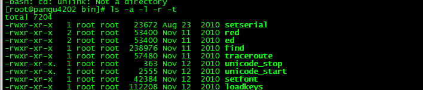
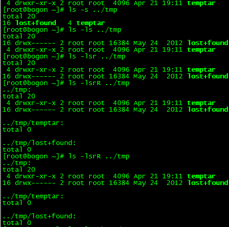
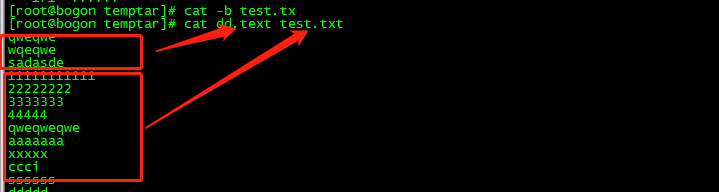
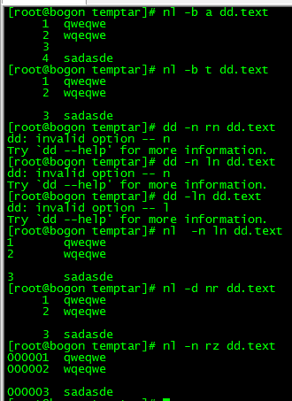

# linux 


## 万能的帮助命令

### man 帮助

- ​	man 是 manual 的缩写，

- man 帮助用法演示：
  
- # man ls
  
- man 也是一条命令，分为 9 章，可以使用man 命令获得 man 的帮助
  
  - man 也是⼀条命令，分为 9 章，可以使⽤ man 命令获得 man 的帮助

### help 帮助

- shell（命令解释器）⾃带的命令称为内部命令，其他的是外部命令
- 内部命令使用 help 帮助
  - \# help cd
- 外部命令使⽤help帮助
  - \# ls --help

### info 帮助

- info 帮助比 help 更详细，作为 help 的补充
  - \# info ls

## 文件操作

### 显示当前的目录名称 pwd 

​		pwd 显示当前的目录名称

### 文件查看 ls 命令

- ls 查看当前目录下的文件
  
- ls [选项，选项… ] 参数 … 
  
- 命令格式

   ls [选项] [目录名]  

- 常用参数：

  - -l 长格式显示文件

    • -a 显示隐藏文件

    • -r 逆序显示

    • -t 按照时间顺序显示

    • -R 递归显示
    
  - -k 即 –block-size=1K,以 k 字节的形式表示文件的大小。 

  -  -m 所有项目以逗号分隔，并填满整行行宽
     -o 类似 -l,显示文件的除组信息外的详细信息。
     -r, –reverse 依相反次序排列
     -R, –recursive 同时列出所有子目录层
     -s, –size 以块大小为单位列出所有文件的大小
     -S 根据文件大小排序 

  -  -t 以文件修改时间排序
     -u 配合 -lt:显示访问时间而且依访问时间排序
     配合 -l:显示访问时间但根据名称排序
     否则：根据访问时间排序 

- eg:

  ​     如果多个包命令的话可以 ls -lartR   或者 ls -a -l -r -t -R

    



### 建⽴⽬录  mkdir命令

Linux mkdir命令用于建立名称为 dirName 之子目录。

语法

```
mkdir [-p] dirName
```

**参数说明**：

 -p 确保目录名称存在，不存在的就建一个

-m <目标属性>或-mode<目标属性>建立目录的同时设置目录的权限

**目录：指定要创建的目录列表，多个目录用空格隔开**

eg:

在工作目录下，建立一个名为 AAA 的子目录 :

```
mkdir AAA
```

在工作目录下的 BBB 目录中，建立一个名为 Test 的子目录。 若 BBB 目录原本不存在，则建立一个。（注：本例若不加 -p，且原本 BBB目录不存在，则产生错误。）

```
mkdir -p BBB/Test
```

在目录/usr/meng下创建子目录 test ，并且只有文件主有读写执行权限， 其他人无权访问

> **mkdir -m 700 /usr/meng/test**

在当前目录下创建bin 和/bin/os_1 目录， 权限设置为文件主读写可执行，同组用户读写，其他用户无权访问

> **mkdir -p-m 750 bin/os_1**

### 删除目录

#### 删除空⽬录  rmdir

Linux rmdir命令删除空的目录。

语法

```
rmdir [-p] dirName
```

**参数**：

-  -p 是当子目录被删除后使它也成为空目录的话，则顺便一并删除。

eg:

- 1. 将工作目录下，名为 AAA 的子目录删除 :

- rmdir AAA

- 在工作目录下的 BBB 目录中，删除名为 Test 的子目录。若 Test 删除后，BBB 目录成为空目录，则 BBB 亦予删除

- ```
  rmdir -p BBB/Test
  ```

#### 删除⾮空⽬录   rm

Linux rm命令用于删除一个文件或者目录。

语法

```
rm [options] name...
```

**参数**：

- -i 删除前逐一询问确认。
- -f 即使原档案属性设为唯读，亦直接删除，无需逐一确认。
- -r 将目录及以下之档案亦逐一删除。

实例

删除文件可以直接使用rm命令，若删除目录则必须配合选项"-r"，例如：

```
# rm  test.txt 
rm：是否删除 一般文件 "test.txt"? y  
# rm  homework  
rm: 无法删除目录"homework": 是一个目录  
# rm  -r  homework  
rm：是否删除 目录 "homework"? y
```

删除当前目录下的所有文件及目录，命令行为：

```
rm  -r  * 
```

文件一旦通过rm命令删除，则无法恢复，所以必须格外小心地使用该命令。

### 复制⽂件和⽬录  cp

Linux cp命令主要用于复制文件或目录。

语法

```
cp [options] source dest
```

或

```
cp [options] source... directory
```

**参数说明**：

- -a：此选项通常在复制目录时使用，它保留链接、文件属性，并复制目录下的所有内容。其作用等于dpR参数组合。
- -d：复制时保留链接。这里所说的链接相当于Windows系统中的快捷方式。
- -f：覆盖已经存在的目标文件而不给出提示。
- -i：与-f选项相反，在覆盖目标文件之前给出提示，要求用户确认是否覆盖，回答"y"时目标文件将被覆盖。
- -p：除复制文件的内容外，还把用户、修改时间和访问权限也复制到新文件中。
- -r：若给出的源文件是一个目录文件，此时将复制该目录下所有的子目录和文件。
- -l：不复制文件，只是生成链接文件。

实例

使用指令"cp"将当前目录"test/"下的所有文件复制到新目录"newtest"下，输入如下命令：

```
$ cp –r test/ newtest          
```

**注意：用户使用该指令复制目录时，必须使用参数"-r"或者"-R"。**

### 移动⽂件/目录  移动、改名  mv

Linux mv 命令用来为文件或目录改名、或将文件或目录移入其它位置。

```
mv [options] source dest
mv [options] source... directory
```

**参数说明**：

- -i: 若指定目录已有同名文件，则先询问是否覆盖旧文件;
- -f: 在 mv 操作要覆盖某已有的目标文件时不给任何指示;

mv参数设置与运行结果

| 命令格式         | 运行结果                                                     |
| :--------------- | :----------------------------------------------------------- |
| mv 文件名 文件名 | 将源文件名改为目标文件名                                     |
| mv 文件名 目录名 | 将文件移动到目标目录                                         |
| mv 目录名 目录名 | 目标目录已存在，将源目录移动到目标目录；目标目录不存在则改名 |
| mv 目录名 文件名 | 出错                                                         |

实例

将文件 aaa 更名为 bbb :

```
mv aaa bbb
```

将info目录放入logs目录中。注意，如果logs目录不存在，则该命令将info改名为logs。

```
mv info/ logs 
```

再如将/usr/student下的所有文件和目录移到当前目录下，命令行为：

```
$ mv /usr/student/*  . 
```

**mv 操作文件时是移动并且重命名。**

目标目录与原目录一致，指定了新文件名，效果就是仅仅重命名。

```
mv  /home/ffxhd/a.txt   /home/ffxhd/b.txt    
```

目标目录与原目录不一致，没有指定新文件名，效果就是仅仅移动。

```
mv  /home/ffxhd/a.txt   /home/ffxhd/test/ 
或者
mv  /home/ffxhd/a.txt   /home/ffxhd/test 
```

目标目录与原目录一致, 指定了新文件名，效果就是：移动 + 重命名。

```
mv  /home/ffxhd/a.txt   /home/ffxhd/test/c.txt
```

批量移动文件和文件夹：(在Ubuntu 18.04 奏效）

例如，将 **/home/ffxhd/testThinkPHP5/tp5** 目录里边的所有文件&文件夹 挪到 **/home/ffxhd/testThinkPHP5**

```
mv  /home/ffxhd/testThinkPHP5/tp5/*  /home/ffxhd/testThinkPHP5
```

注意：需要先执行显示隐藏文件命令，否则，隐藏文件以及隐藏文件夹不会被移动到新目录。

英语点号开头的文件会被作为隐藏文件处理，英语点号开头的文件夹也被作为隐藏文件夹处理。

例如：文件 **.a.txt**， 目录 **.tp5**。

### 通配符

1 Shell常见通配符：

| **通配符**            | **含义**                                    | **实例**                                                     |
| --------------------- | ------------------------------------------- | ------------------------------------------------------------ |
| *                     | 匹配 0 或多个字符                           | a*b a与b之间可以有任意长度的任意字符, 也可以一个也没有, 如aabcb, axyzb, a012b, ab。 |
| ?                     | 匹配任意一个字符                            | a?b a与b之间必须也只能有一个字符, 可以是任意字符, 如aab, abb, acb, a0b。 |
| [list]                | 匹配 list 中的任意单一字符                  | a[xyz]b  a与b之间必须也只能有一个字符, 但只能是 x 或 y 或 z, 如: axb, ayb, azb。 |
| [!list]或[^list]      | 匹配 除list 中的任意单一字符                | a[!0-9]b a与b之间必须也只能有一个字符, 但不能是阿拉伯数字, 如axb, aab, a-b。 |
| [c1-c2]               | 匹配 c1-c2 中的任意单一字符 如：[0-9] [a-z] | a[0-9]b 0与9之间必须也只能有一个字符 如a0b, a1b... a9b。     |
| [!c1-c2]或[^c1-c2]    | 匹配不在c1-c2的任意字符                     | a[!0-9]b 如acb adb                                           |
| {string1,string2,...} | 匹配 sring1 或 string2 (或更多)其一字符串   | a{abc,xyz,123}b 列出aabcb,axyzb,a123b                        |


通配符是shell在做PathnameExpansion时用到的。说白了一般只用于文件名匹配，它是由shell解析的，比如find，ls，cp，mv等。

## 文本操作

### 文本的查看

 - cat: 由第一行开始显示文件内容

 - tac: 从最后一行开始显示，可以看出tac是cat的倒写形式

 - nl: 显示的时候顺便显示行号

 - more: 一页一页地显示文件内容

 -  less: 与more类似，但是比more更好的是，可以往前翻页

 -  tail: 只看结尾几行

 -  od: 以二进制的方式读取文件内容

   

   ####  tail 命令

tail 命令可用于查看文件的内容，有一个常用的参数 **-f** 常用于查阅正在改变的日志文件。

   tail  【参数】 文件...

   参数

   - ​     -f 循环读取

   - 　　-q 不显示处理信息

   - 　　-v 显示详细的处理信息

   - 　　-c<数目> 显示的字节数

   - 　　-n<行数> 显示行数

     eg: tail -n 10 test.txt  显示文件的后几行

     #### cat 命令 

      cat  [OPTION] ... [FILE]....

     参数

     **-n 或 --number**：由 1 开始对所有输出的行数编号。

     **-b 或 --number-nonblank**：和 -n 相似，只不过对于空白行不编号。

     **-s 或 --squeeze-blank**：当遇到有连续两行以上的空白行，就代换为一行的空白行。

     **-v 或 --show-nonprinting**：使用 ^ 和 M- 符号，除了 LFD 和 TAB 之外。

     **-E 或 --show-ends** : 在每行结束处显示 $。

     **-T 或 --show-tabs**: 将 TAB 字符显示为 ^I。

      **-A, --show-all**：等价于 -vET。

      **-e：**等价于"-vE"选项；

      **-t：**等价于"-vT"选项；

     也可以把多个文件的内容拼接起来多个显示

     

**实例**

要显示 notes.log 文件的最后 10 行，请输入以下命令：

```
tail notes.log
```

要跟踪名为 notes.log 的文件的增长情况，请输入以下命令：

```
tail -f notes.log
```

此命令显示 notes.log 文件的最后 10 行。当将某些行添加至 notes.log 文件时，tail 命令会继续显示这些行。 显示一直继续，直到您按下（Ctrl-C）组合键停止显示。

显示文件 notes.log 的内容，从第 20 行至文件末尾:

```
tail +20 notes.log
```

显示文件 notes.log 的最后 10 个字符:

```
tail -c 10 notes.log
```


#### tac 命令 

   tac [OPTION]... [FILE]...

#### nl 命令  

-b  ：指定行号指定的方式，主要有两种：
    -b a ：表示不论是否为空行，也同样列出行号(类似 cat -n)；
    -b t ：如果有空行，空的那一行不要列出行号(默认值)；
-n  ：列出行号表示的方法，主要有三种：
    -n ln ：行号在萤幕的最左方显示；
    -n rn ：行号在自己栏位的最右方显示，且不加 0 ；
    -n rz ：行号在自己栏位的最右方显示，且加 

显示的时候显示行号


#### more 命令

Linux more 命令类似 cat ，不过会以一页一页的形式显示，更方便使用者逐页阅读，而最基本的指令就是按空白键（space）就往下一页显示，按 b 键就会往回（back）一页显示，而且还有搜寻字串的功能（与 vi 相似），使用中的说明文件，请按 h 。

 more [-dlfpcsu] [-num] [+/ pattern] [+ linenum] [file ...]

空白键 （space） ：代表向下翻一页；
Enter ：代表向下翻“一行”；
/字串 ：代表在这个显示的内容当中，向下搜寻“字串”这个关键字；
:f ：立刻显示出文件名以及目前显示的行数；
q ：代表立刻离开 more ，不再显示该文件内容。
b 或 [ctrl]-b ：代表往回翻页，不过这动作只对文件有用，对管线无用。

- -num 一次显示的行数
- -d 提示使用者，在画面下方显示 [Press space to continue, 'q' to quit.] ，如果使用者按错键，则会显示 [Press 'h' for instructions.] 而不是 '哔' 声
- -l 取消遇见特殊字元 ^L（送纸字元）时会暂停的功能
- -f 计算行数时，以实际上的行数，而非自动换行过后的行数（有些单行字数太长的会被扩展为两行或两行以上）
- -p 不以卷动的方式显示每一页，而是先清除萤幕后再显示内容
- -c 跟 -p 相似，不同的是先显示内容再清除其他旧资料
- -s 当遇到有连续两行以上的空白行，就代换为一行的空白行
- -u 不显示下引号 （根据环境变数 TERM 指定的 terminal 而有所不同）
- +/pattern 在每个文档显示前搜寻该字串（pattern），然后从该字串之后开始显示
- +num 从第 num 行开始显示
- fileNames 欲显示内容的文档，可为复数个数

 输入了 / 之后，光标就会跑到最下面一行，并且等待你的输入， 你输入了字串并按下[enter]之后，嘿嘿！ more 就会开始向下搜寻该字串啰～而重复搜寻同一个字串，可以直接按下 n 即可啊！最后，不想要看了，就按下 q 即可离开 more 啦 

**常用操作命令**

- Enter 向下n行，需要定义。默认为1行
- Ctrl+F 向下滚动一屏
- 空格键 向下滚动一屏
- Ctrl+B 返回上一屏
- = 输出当前行的行号
- ：f 输出文件名和当前行的行号
- V 调用vi编辑器
- !命令 调用Shell，并执行命令
- q 退出more

#### less 命令

 less [参数] 文件 

 less 与 more 类似，但使用 less 可以随意浏览文件，而 more 仅能向前移动，却不能向后移动，而且 less 在查看之前不会加载整个文件。 

**命令参数：**

-b <缓冲区大小> 设置缓冲区的大小

-e 当文件显示结束后，自动离开

-f 强迫打开特殊文件，例如外围设备代号、目录和二进制文件

-g 只标志最后搜索的关键词

-i 忽略搜索时的大小写

-m 显示类似more命令的百分比

-N 显示每行的行号

-o <文件名> 将less 输出的内容在指定文件中保存起来

-Q 不使用警告音

-s 显示连续空行为一行

-S 行过长时间将超出部分舍弃

-x <数字> 将“tab”键显示为规定的数字空格

/字符串：向下搜索“字符串”的功能

?字符串：向上搜索“字符串”的功能

n：重复前一个搜索（与 / 或 ? 有关）

N：反向重复前一个搜索（与 / 或 ? 有关）

b 向后翻一页

d 向后翻半页

u 向前滚动半页

h 显示帮助界面

Q 退出less 命令

y 向前滚动一行

空格键 滚动一行

回车键 滚动一页

[pagedown]： 向下翻动一页

[pageup]：  向上翻动一页

实例

1、查看文件

```
less log2013.log
```

2、ps查看进程信息并通过less分页显示

```
ps -ef |less
```

3、查看命令历史使用记录并通过less分页显示

```
[root@localhost test]# history | less
22  scp -r tomcat6.0.32 root@192.168.120.203:/opt/soft
23  cd ..
24  scp -r web root@192.168.120.203:/opt/
25  cd soft
26  ls
……省略……
```

4、浏览多个文件

```
less log2013.log log2014.log
```

说明：
输入 ：n后，切换到 log2014.log
输入 ：p 后，切换到log2013.log

- 附加备注

1.全屏导航

- ctrl + F - 向前移动一屏
- ctrl + B - 向后移动一屏
- ctrl + D - 向前移动半屏
- ctrl + U - 向后移动半屏

2.单行导航

- j - 向前移动一行
- k - 向后移动一行

3.其它导航

- G - 移动到最后一行
- g - 移动到第一行
- q / ZZ - 退出 less 命令

4.其它有用的命令

- v - 使用配置的编辑器编辑当前文件
- h - 显示 less 的帮助文档
- &pattern - 仅显示匹配模式的行，而不是整个文件

5.标记导航

当使用 less 查看大文件时，可以在任何一个位置作标记，可以通过命令导航到标有特定标记的文本位置：

- ma - 使用 a 标记文本的当前位置
- 'a - 导航到标记 a 处


#### 统计⽂件内容信息 wc

利用wc指令我们可以计算文件的Byte数、字数、或是列数，若不指定文件名称、或是所给予的文件名为"-"，则wc指令会从标准输入设备读取数据。

语法

```
wc [-clw][--help][--version][文件...]
```

**参数**：

- -c或--bytes或--chars 只显示Bytes数。
- -l或--lines 只显示行数。
- -w或--words 只显示字数。
- --help 在线帮助。
- --version 显示版本信息。

实例

在默认的情况下，wc将计算指定文件的行数、字数，以及字节数。使用的命令为：

```
wc testfile 
```

先查看testfile文件的内容，可以看到：

```
$ cat testfile  
Linux networks are becoming more and more common, but scurity is often an overlooked  
issue. Unfortunately, in today’s environment all networks are potential hacker targets,  
fro0m tp-secret military research networks to small home LANs.  
Linux Network Securty focuses on securing Linux in a networked environment, where the  
security of the entire network needs to be considered rather than just isolated machines.  
It uses a mix of theory and practicl techniques to teach administrators how to install and  
use security applications, as well as how the applcations work and why they are necesary. 
```

使用 wc统计，结果如下：

```
$ wc testfile           # testfile文件的统计信息  
3 92 598 testfile       # testfile文件的行数为3、单词数92、字节数598 
```

其中，3 个数字分别表示testfile文件的行数、单词数，以及该文件的字节数。

如果想同时统计多个文件的信息，例如同时统计testfile、testfile_1、testfile_2，可使用如下命令：

```
wc testfile testfile_1 testfile_2   #统计三个文件的信息 
```

输出结果如下：

```
$ wc testfile testfile_1 testfile_2  #统计三个文件的信息  
3 92 598 testfile                    #第一个文件行数为3、单词数92、字节数598  
9 18 78 testfile_1                   #第二个文件的行数为9、单词数18、字节数78  
3 6 32 testfile_2                    #第三个文件的行数为3、单词数6、字节数32  
15 116 708 总用量                    #三个文件总共的行数为15、单词数116、字节数708 
```


## 压缩与打包

最早的 Linux 备份介质是磁带，使⽤的命令是 tar

• 可以打包后的磁带⽂件进⾏压缩储存，压缩的命令是 gzip 和 bzip2

• 经常使⽤的扩展名是 .tar.gz .tar.bz2 .tg

### tar 打包命令

目标文件为要打包成的文件的文件名， 打包后文件的 格式取决于目标文件的后缀名

tar <operation> [options]

常⽤参数

• c 打包

• x 解包

• f 指定操作类型为⽂件

 

​       --delete

       Common Options:
       -C, --directory DIR
       -f, --file F
       -j, --bzip2
       -p, --preserve-permissions
       -v, --verbose
       -z, --gzip