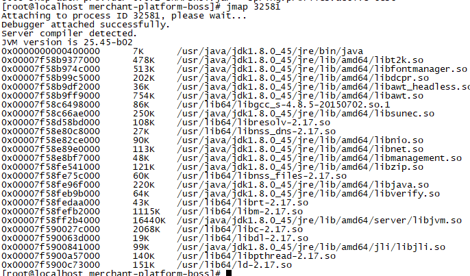
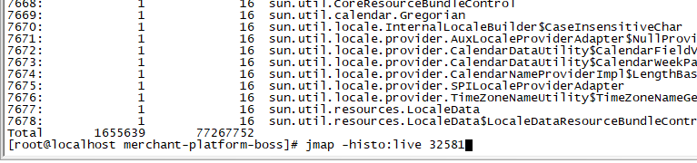
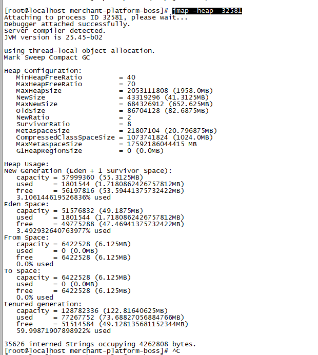
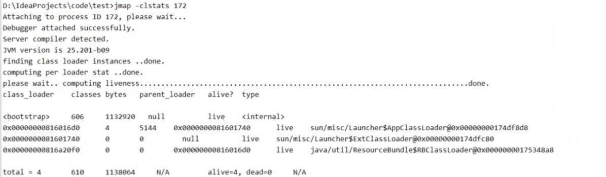
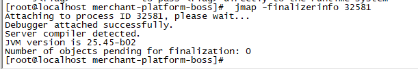
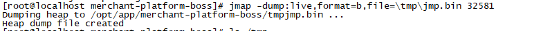
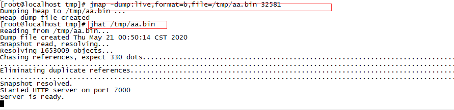
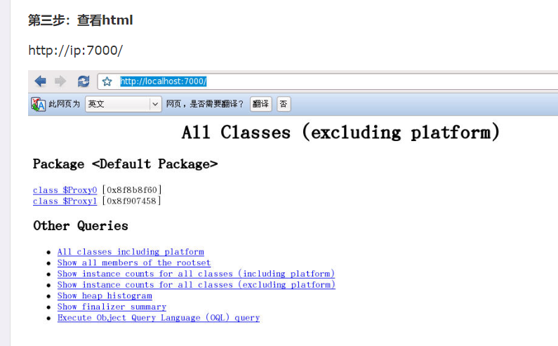
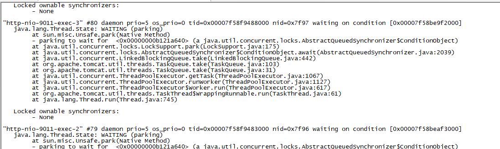

# 性能工具

## JDK性能监控工具

### 查看Java进程——jps命令

jps类似于ps命令，不同的是它只列出系统中所有java应用程序，jps命令格式

#### 用来显示当前java进程的指令，能显示进程id及进程名称（多指jar包名称、class名称）

命令格式  

jps  [-q]  [-mlvV]  [<hostid>]

第一个参数

-q 只显示进程ID

-m 显示进程PID ,主类名称，以及传给main方法的参数

-l 显示进程PID 主类名称，以及JVM的入参参数

-v  进程PID,主类名称

 [-mlvV]  参数可以任意组合

第二个参数：hostid 

主机或者服务器的IP，如果不指定就默认为当前机器或者服务器

注意：如果需要查看查看其它的机器需要在呆查看机器上启动jstatd


### Jstat-虚拟机的运行状态信息，

https://www.cnblogs.com/lxcmyf/p/9878293.html

#### 可以显示本地或者远程虚拟机的中类的装载，内存，垃圾收集，JIT编译等运行数据

参考格式

jstat -options  [c]  [interval] [cout]

 jstat  -[ options | outputOptions vmid [ interval[s|ms] [ count ] ]

options 的参数如下

-  class (类加载器)  显示类加载器行为的统计信息，根类加载，应用程序类加载器，扩展类加载器，自定义类加载器 

- compiler (JIT)  显示JVM的即时编译行为的统计信息

-   gc (GC堆状态)  显示有关垃圾收集堆得有关信息，用kb表示

- gccapacity (各区大小) 显示垃圾回收代的容量以及相应空间的统计信息

-  gccause (最近一次GC统计和原因) ，显示垃圾收集有关信息（同Gcutil）

- gcnew (新区统计)  显示新增代的行为统计

-  gcnewcapacity (新区大小) 显示新生代以及有关空间信息的统计

-   gcold (老区统计)  显示老年代的行为统计和元空间统计信息

-   gcoldcapacity (老区大小)  显示老年代的大小统计信息 

-  gcpermcapacity (永久区大小) 有关元空间大小的统计

- gcutil (GC统计汇总) 显示垃圾收集统计信息，显示百分比

- printcompilation (HotSpot编译统计) 显示JVM 编译方法的统计


vmid 如果是本地的虚拟机进程则 ，vmid 就是本地的java进行的ID 

如果是远程的的   [protocol:][//]lvmid[@hostname[:port]/servername]

第三个参数 interval

采样间隔，单位为秒（s）或者毫秒（ms）

默认单位为毫秒，必须为正数 ，指定后该jstat 命令将在每个间隔时间输出

第四个参数 count 

显示要显示的样本数

示例：


#### 1、jstat –class <pid> : 显示加载class的数量，及所占空间等信息。

jstat -class 7984


显示列名具体描述

Loaded ：装载的类的数量

Bytes：装载类所占用的字节数

Unloaded：卸载类的数量

Bytes：卸载类的字节数

Time：装载和卸载类所花费的时间

#### 2.jstat -compiler  显示JVM的即时编译行为的统计信息


显示列名具体描述

Compiled：编译任务执行数量

Failed：编译任务执行失败数量

Invalid  ：编译任务执行失效数量

Time  ：编译任务消耗时间

FailedType：最后一个编译失败任务的类型

FailedMethod：最后一个编译失败任务所在的类及方法

#### 3 jstat -gc

 


显示列名具体描述

S0C  年轻代中第一个survivor（幸存区）的容量 (字节)

S1C  年轻代中第二个survivor（幸存区）的容量 (字节)

S0U  年轻代中第一个survivor（幸存区）目前已使用空间 (字节)

S1U   年轻代中第二个survivor（幸存区）目前已使用空间 (字节)

EC    年轻代中Eden（伊甸园）的容量 (字节)

EU    年轻代中Eden（伊甸园）目前已使用空间 (字节)

OC     Old代的容量 (字节)

OU    Old代目前已使用空间 (字节)

MC  元空间的容量 （java8）

MU  元空间的容量的使用量 （java8）

PC   Perm(持久代)的容量 (字节) （java7）

PU  Perm(持久代)目前已使用空间 (字节)  （java7）

CCSC  压缩类空间容量  （java8）

CCSU 压缩类空间使用量   （java8）

YGC   从应用程序启动到采样时年轻代中gc次数

YGCT  从应用程序启动到采样时年轻代中yong gc所用时间(s)

FGC  从应用程序启动到采样时old代(full gc)gc次数

FGCT   从应用程序启动到采样时old代(full gc)gc所用时间(s)

GCT  从应用程序启动到采样时gc用的总时间(s)

#### 4.jstat -gcutil  


显示列名具体描述

S0   年轻代中第一个survivor（幸存区）已使用的占当前容量百分比

S1   年轻代中第二个survivor（幸存区）已使用的占当前容量百分比

E   年轻代中Eden（伊甸园）已使用的占当前容量百分比

O   old代已使用的占当前容量百分比

P   perm代已使用的占当前容量百分比

M 元空间使用占比 （ java8）

CCS  （java8）

YGC   从应用程序启动到采样时年轻代中gc次数

YGCT  从应用程序启动到采样时年轻代中gc所用时间(s)

FGC  从应用程序启动到采样时old代(全gc)gc次数

FGCT   从应用程序启动到采样时old代(全gc)gc所用时间(s)

GCT 从应用程序启动到采样时gc用的总时间(s)


#### 5.jstat -gccapacity   (各区大小) 显示垃圾回收代的容量以及相应空间的统计信息


显示列名具体描述

NGCMN  年轻代(young)中初始化(最小)的大小(字节)

NGCMX   年轻代(young)的最大容量 (字节)

NGC   年轻代(young)中当前的容量 (字节)

S0C  年轻代中第一个survivor（幸存区）的容量 (字节)

S1C    年轻代中第二个survivor（幸存区）的容量 (字节)

EC   年轻代中Eden（伊甸园）的容量 (字节)

OGCMN   old代中初始化(最小)的大小 (字节)

OGCMX    old代的最大容量(字节)

OGCold代当前新生成的容量 (字节)

OC   Old代的容量 (字节)

PGCMN  perm代中初始化(最小)的大小 (字节)

PGCMX   perm代的最大容量 (字节)  

PGC    perm代当前新生成的容量 (字节)

PC   Perm(持久代)的容量 (字节)

YGC  从应用程序启动到采样时年轻代中gc次数

FGC  从应用程序启动到采样时old代(全gc)gc次数

#### 6.jstat -gcnew   (新区统计)  显示新增代的行为统计


显示列名具体描述

S0C  年轻代中第一个survivor（幸存区）的容量 (字节)

S1C  年轻代中第二个survivor（幸存区）的容量 (字节)

S0U  年轻代中第一个survivor（幸存区）目前已使用空间 (字节)

S1U  年轻代中第二个survivor（幸存区）目前已使用空间 (字节)

TT  持有次数限制

MTT 最大持有次数限制

EC    年轻代中Eden（伊甸园）的容量 (字节)

EU   年轻代中Eden（伊甸园）目前已使用空间 (字节)

YGC   从应用程序启动到采样时年轻代中gc次数

YGCT 从应用程序启动到采样时年轻代中gc所用时间(s)

### jinfo - 实时查看和调整动态调整JVM的各项参数

参数格式

jinfo -options process_id 


参数解释

-options 为空的话，显示所有的JVM 的各项参数设置

-flag name  输出对应参名称的参数

-flags :输出全部的参数

-sysprops :输出系统属性

-flag name=value:设定对应名称的参数


虚拟机的参数可以通过这个命令查看：

java -XX:+PrintFlagsFinal -version | grep manageable

-flag  [+|-]name  打开或者关闭对应的参数 

```
除了通过启动脚本可以设置参数，PrintGC 默认是打开的，因此我们只需要打开 PrintGCDetails 参数。	

jinfo -flag +PrintGC 43520

 jinfo -flag +PrintGCDetails 43520
```


关闭 GC 日志的话同理：

```
jinfo -flag -PrintGC 43520

 jinfo -flag -PrintGCDetails 43520
```

查看是否开启 GC 日志的打印：

```
[root@admin ~]# jinfo -flag PrintGC 43520
-XX:-PrintGC

[root@admin ~]# jinfo -flag PrintGCDetails 43520
-XX:-PrintGCDetails
```

常用 JVM 参数

```
-Xms：初始堆大小，默认为物理内存的1/64(<1GB)；默认(MinHeapFreeRatio参数可以调整)空余堆内存小于40%时，JVM就会增大堆直到-Xmx的最大限制

-Xmx：最大堆大小，默认(MaxHeapFreeRatio参数可以调整)空余堆内存大于70%时，JVM会减少堆直到 -Xms的最小限制

-Xmn：新生代的内存空间大小，注意：此处的大小是（eden+ 2 survivor space)。与jmap -heap中显示的New gen是不同的。整个堆大小=新生代大小 + 老生代大小 + 永久代大小。在保证堆大小不变的情况下，增大新生代后,将会减小老生代大小。此值对系统性能影响较大,Sun官方推荐配置为整个堆的3/8。

-XX:SurvivorRatio：新生代中Eden区域与Survivor区域的容量比值，默认值为8。两个Survivor区与一个Eden区的比值为2:8,一个Survivor区占整个年轻代的1/10。

-Xss：每个线程的堆栈大小。JDK5.0以后每个线程堆栈大小为1M,以前每个线程堆栈大小为256K。应根据应用的线程所需内存大小进行适当调整。在相同物理内存下,减小这个值能生成更多的线程。但是操作系统对一个进程内的线程数还是有限制的，不能无限生成，经验值在3000~5000左右。一般小的应用， 如果栈不是很深， 应该是128k够用的，大的应用建议使用256k。这个选项对性能影响比较大，需要严格的测试。和threadstacksize选项解释很类似,官方文档似乎没有解释,在论坛中有这样一句话:"-Xss is translated in a VM flag named ThreadStackSize”一般设置这个值就可以了。

-XX:PermSize：设置永久代(perm gen)初始值。默认值为物理内存的1/64。

-XX:MaxPermSize：设置持久代最大值。物理内存的1/4。
```

### jmap-  可以查看堆中对象的信息，也可以生成程序的dump文件，查看classloader的信息以及 finalizer队列

```
jmap不仅能生成dump文件，还可以查询finalize执行队列、Java堆和永久代的详细信息，如当前使用率、当前使用的是哪种收集器等，可以使用-XX:+HeapDumpOnOutOfMemoryError参数来让虚拟机出现OOM的时候·自动生成dump文件
```

```

```

用法

       jmap [ options ] pid
       jmap [ options ] executable core
       jmap [ options ] [ pid ] server-id@ ] remote-hostname-or-IP
参数

option：选项参数，不可同时使用多个选项参数

-  pid：java进程id，命令ps -ef | grep java获取
- executable：产生核心dump的java可执行文件
- core：需要打印配置信息的核心文件
- remote-hostname-or-ip：远程调试的主机名或ip
- server-id：可选的唯一id，如果相同的远程主机上运行了多台调试服务器，用此选项参数标识服务器
- clstats:打印类加载器信息
- -dump:[live,]format=b,file=<filename> 使用hprof二进制形式,输出jvm的heap内容到文件=. live子选项是可选的，假如指定live选项,那么只输出活的对象到文件.生成堆快照文件
-  -finalizerinfo 打印正等候回收的对象的信息（F-Queue队列等待finalizer线程执行对象的finalizer方法的对象，垃圾回收器在执行垃圾回收GC的时候回调用finalizer方法去释放内存）-heap 打印堆的详细信息，以及堆中不同代的占用情况，GC使用的算法，heap的配置
- histo[:live] 显示堆中存类的对象的统计信息， 如果不带live,则显示堆中所有的对象   jmap -histo:live  pid


示例 jmap pid     显示进程中共享对象的信息

显示结果中 

内存地址   对象大小  文件的位置



示例 2   jmap -histo:live 32581

打印出每个类对应的统计信息

编号  对象个数 占用大小（bytes） 对应的类



示例 2   jmap -heap  32581

显示了堆的配置信息、堆的使用情况



示例   jmap -clstats 32581



示例  jmap -finalizerinfo 32581

显示 进程中被GC的对象，等待执行finalizer放的对象



示例 jmap -dump 生成堆的快照文件

jmap -dump:live,format=b,file=\tmp\jmp.bin 32581

说明： :live 只生成只存活的对象的块

format=b 以二进制的形式存储

file 生成快照的文件的位置



### Jhat 快照文件分析

jhat 用来进行快照文件的分析，这个工具的功能单一，一般用jdk自带的分析工具visiVM来进行堆快照的文件分析

命令格式

jhat [ options ] heap-dump-file

\#jhat -J-Xmx512M a1.log

说明：有时dump出来的堆很大，在启动时会报堆空间不足的错误，可加参数：jhat -J-Xmx512m <heap dump file>。这个内存大小可根据自己电脑进行设置。

### 解析Java堆转储文件,并启动一个 web server






### jstack  查看或者导出 java应用程序中的线程堆栈信息


用法

SYNOPSIS
     

     
       jstack [ options ] pid
       jstack [ options ] executable core
        jstack [ options ] [ server-id@ ] remote-hostname-or-IP
参数说明:

pid: java应用程序的进程号,一般可以通过jps来获得;

executable:产生core dump的java可执行程序;

core:打印出的core文件;

remote-hostname-or-ip:远程debug服务器的名称或IP;

server-id: 唯一id,假如一台主机上多个远程debug服务;

options 参数说明

-F ：当线程挂起的时候是不会打印线程的堆栈信息的，加上这个参数可以打印线程的堆栈信息

-l:处堆栈信息外还会打印锁的附加信息，例如 ownable synchronizer

-m：可以同时输出java以及c/c++的堆栈信息

示例 jstack -l 32581

显示了锁的状态  daemon  进程的守护线程 prio 线程等级  nid 线程id(十六进程) 线程的状态



Thread-1：是线程名称。
tid：Java的线程ID。
nid：每一个Java线程在操作系统层面都与一个线程对应，这个线程ID就是nid。
prio：线程优先级。
waiting for monitor entry[0x063bf000]：等待获取对象锁，而这个对象正好由thread-0所持有
[0x063bf000]：线程栈起始地址。